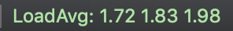

# iterm2-statusbar-scripts
Python scripts for iTerm2 custom status bar components

## Install

```
./install.sh
```

install.sh creates symbolic link for each scripts.  
After this, relaunch iTerm2.

## Sctipts

### loadaverage.py

  
It shows Load Average.

### publicip.py

  
It shows public ip address.  
It uses `http://checkip.amazonaws.com`

### rootvolume.py

  
It shows usage of root volume.

### unixtime.py

  
It shows current Unix time.
